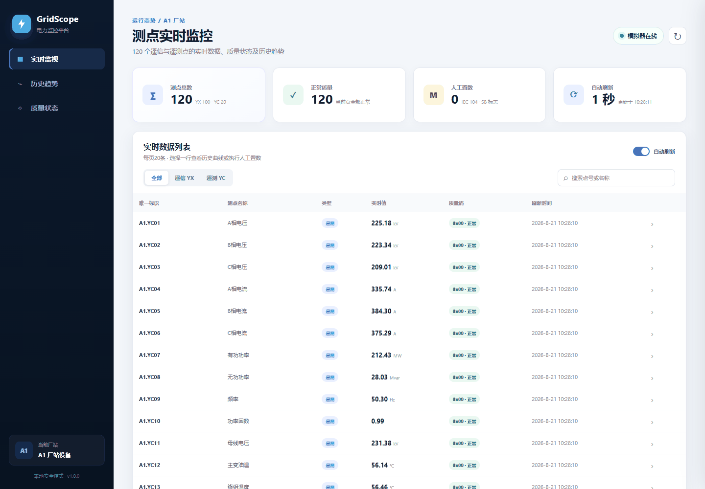
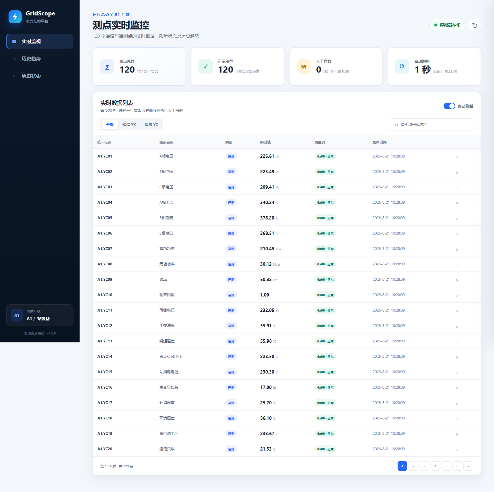

# 电力测点实时监控工具

一套可在 Windows 本机独立运行的电力测点实时监控演示系统。项目固定管理 A1 厂站的 100 个遥信点（YX00–YX99）和 20 个遥测点（YC01–YC20），由数据模拟器和监视程序两个独立进程组成。



## 功能概览

- 遥测点每 1 秒全部执行一次有边界随机变化。
- 每 10 秒随机翻转一个非人工置数的遥信点。
- 列表支持 YX/YC 筛选、点号搜索、每页 20 条和 6 页分页。
- 支持自动刷新暂停、手动刷新、连接中断提示和自动重连。
- 支持 YX/YC 人工置数与解除置数；人工值使用 IEC 60870-5-104 `SB=0x20` 标记。
- SQLite 持久化最近 10 分钟历史，提供 1/5/10 分钟折线或阶梯曲线。
- 两个单文件 EXE 均内置 Python 运行时，无需安装 Python 或 IDE。



## 快速开始

1. 下载或克隆本仓库。
2. 双击根目录的 `一键启动.bat`。
3. 等待约 3 秒，浏览器会自动打开 <http://127.0.0.1:9010>。
4. 使用完成后双击 `一键停止.bat`。

如果浏览器没有自动打开，可手动访问上述地址。服务只绑定 `127.0.0.1`，不会暴露到局域网。

## 页面操作

- 使用“全部 / 遥信 YX / 遥测 YC”和搜索框筛选测点。
- 点击底部分页按钮查看全部 120 个点。
- 关闭“自动刷新”可暂停页面更新；右上角刷新按钮可立即重新采集。
- 点击任一数据行打开历史趋势，可切换近 1、5、10 分钟。
- 点击“人工置数”并输入合法值后，质量码会变为 `0x20 · 人工替代`。
- 点击“解除置数”可恢复 `0x00 · 正常`及原模拟逻辑。

## 系统架构

```text
浏览器界面 :9010
      │ REST / 静态资源
      ▼
监视程序（缓存、分页、SQLite 历史）
      │ 每秒拉取 120 点 / 转发置数
      ▼
数据模拟器 :9011
```

数据模拟器与监视程序分别维护线程安全状态；模拟器断线时，监视程序保留最后快照并明确标记“数据陈旧”，后台继续尝试重连。

## 从源码运行

运行环境为 Python 3.10 或更高版本，应用本身仅使用 Python 标准库。

```powershell
cd 源代码
python simulator_app.py
```

再打开一个终端：

```powershell
cd 源代码
python monitor_app.py
```

也可以直接双击 `源代码/运行源码.bat`。

## 自动化测试

```powershell
cd 源代码
python -m unittest discover -s tests -p "test_*.py" -v
python tests/run_acceptance.py
python scripts/comment_ratio.py .
```

当前交付验证结果：

| 检查项 | 结果 |
|---|---:|
| 单元测试 | 14 项通过 |
| 真实周期验收 | 12 秒通过 |
| 遥测变化 | 20/20 点变化 |
| 遥信变化 | 10 秒窗口变化 1 点 |
| 并发性能 | 80 次请求，P95 103.71 ms |
| 历史写入 | 1,560 行 |
| 生产源码注释率 | 18.43% |
| 独立 EXE 冒烟 | 全部通过 |

详细结果位于 `佐证材料/自动化验收结果.json`、`佐证材料/EXE冒烟测试.json` 和 `佐证材料/代码注释率.json`。

## REST API

数据模拟器 `127.0.0.1:9011`：

- `GET /health`
- `GET /api/v1/points`
- `GET /api/v1/points/{pointId}`
- `PUT /api/v1/points/{pointId}/manual`
- `DELETE /api/v1/points/{pointId}/manual`

监视程序 `127.0.0.1:9010`：

- `GET /api/v1/points?type=&page=&pageSize=20&keyword=`
- `POST /api/v1/refresh`
- `PUT /api/v1/points/{pointId}/manual`
- `DELETE /api/v1/points/{pointId}/manual`
- `GET /api/v1/points/{pointId}/history?minutes=1|5|10`

## 项目结构

```text
电力测点实时监控工具/
├─ README.md
├─ 一键启动.bat / 一键停止.bat
├─ 可执行程序/
│  ├─ 数据模拟器.exe
│  └─ 测点监视工具.exe
├─ 源代码/
│  ├─ simulator_app.py / monitor_app.py
│  ├─ common.py / storage.py
│  ├─ web/
│  ├─ tests/
│  └─ scripts/
├─ 佐证材料/
│  ├─ 运行截图与动态 GIF
│  └─ 自动化验收结果
└─ 需求、设计、测试与佐证 Word 文档
```

## 端口与数据

- 默认端口：监视程序 `9010`，数据模拟器 `9011`。
- 历史数据库：`可执行程序/data/monitor_history.db`（运行后自动创建）。
- 历史保留：滚动 10 分钟。
- 源码模式可使用 `--port`、`--simulator-url` 和 `--data-dir` 自定义运行参数。

